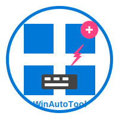

# 🖱️ WinAutoTool (Windows自动化工具)

<div align="center">
  
</div>


`WinAutoTool` 是一个强大的Windows系统自动化工具，提供鼠标操作、键盘控制、剪贴板管理和应用程序启动等全方位功能。无论是日常办公自动化、软件测试还是开发辅助工具，它都能满足您的需求。

## ✨ 特性

- **鼠标控制** - 精确模拟鼠标移动、点击、双击、右键点击和滚轮操作
- **键盘操作** - 支持单键、组合键和功能键(F1-F12)，完美兼容笔记本电脑
- **中文输入** - 专门优化的中文输入支持，解决了常见的中文编码问题
- **剪贴板管理** - 读取和写入剪贴板，支持中英文文本
- **应用程序启动** - 快速启动系统应用、浏览器、Office软件等常用程序
- **完整测试套件** - 提供详尽的测试脚本，验证所有功能

## 🔧 安装

```bash
# 克隆项目
git clone https://github.com/mybolide/WinAutoTool.git

# 进入项目目录
cd WinAutoTool

# 安装依赖
npm install
```

## 📖 使用方法

### 基本导入

```javascript
// 导入所有功能
const automate = require('./automate');

// 或者导入特定模块
const mouse = require('./automate-mouse');
const keyboard = require('./automate-keyboard-nircmd');
const launcher = require('./automate-launcher');
```

### 鼠标操作

```javascript
// 获取鼠标位置
const position = automate.getMousePosition();
console.log(`当前鼠标位置: ${position.x}, ${position.y}`);

// 移动鼠标
automate.setMousePosition(100, 100);

// 点击操作
automate.mouseClick(); // 左键单击
automate.mouseDoubleClick(); // 双击
automate.mouseRightClick(); // 右键单击

// 拖拽操作
automate.mouseDrag(100, 100, 200, 200); // 从(100,100)拖到(200,200)

// 滚轮操作
automate.mouseScroll(10); // 向下滚动
automate.mouseScroll(-10); // 向上滚动
```

### 键盘操作

```javascript
// 按键操作
automate.keyPress('KEY_A'); // 按下A键
automate.keyPress('ENTER'); // 按下回车键
automate.keyPress('F5'); // 按下F5键

// 组合键
automate.keyCombo(['CTRL', 'C']); // Ctrl+C
automate.keyCombo(['ALT', 'F4']); // Alt+F4
automate.keyCombo(['CTRL', 'ALT', 'DELETE']); // Ctrl+Alt+Delete

// 文本输入
automate.typeText('Hello World'); // 输入英文
automate.typeText('你好，世界！'); // 输入中文

// 中文专用输入
automate.typeChineseText('这是专门优化的中文输入');
```

### 剪贴板操作

```javascript
// 复制文本到剪贴板
automate.copyToClipboard('要复制的文本');

// 获取剪贴板内容
const text = automate.getClipboardText();
console.log('剪贴板内容:', text);

// 复制选中内容
const selectedText = automate.copySelection();
```

### 应用程序启动

```javascript
// 系统应用程序
automate.launchSystemApp('notepad'); // 启动记事本
automate.launchSystemApp('calc'); // 启动计算器
automate.launchSystemApp('paint'); // 启动画图

// 浏览器
automate.launchBrowser('https://www.example.com'); // 默认Chrome
automate.launchBrowser('https://www.example.com', 'firefox'); // 指定Firefox
automate.launchBrowser('https://www.example.com', 'edge'); // 指定Edge

// Office应用程序
automate.launchOfficeApp('word'); // 启动Word
automate.launchOfficeApp('excel', 'C:\\path\\to\\file.xlsx'); // 启动Excel并打开文件

// 其他应用程序
automate.launchApp('vscode'); // 启动VS Code
automate.launchApp('wechat'); // 启动微信
```

## 🧪 测试

项目提供了全面的测试套件以验证各个功能：

```bash
# 测试鼠标功能
npm run test:mouse

# 测试键盘功能
npm run test:keyboard

# 测试剪贴板功能
npm run test:clipboard

# 测试功能键(F1-F12)
npm run test:function-keys

# 测试中文输入
npm run test:chinese-dedicated

# 测试应用程序启动器
npm run test:launcher

# 运行所有测试
npm run test:all
```

## 📋 注意事项

1. 本工具需要在Windows系统上运行
2. 需要Node.js 12.0或更高版本
3. 某些功能可能需要管理员权限
4. 使用键盘和鼠标模拟时，请注意不要与当前工作发生冲突
5. 建议在测试前保存所有工作，以防意外操作

## 🤝 贡献

欢迎贡献代码、报告问题或提出新功能建议！请遵循以下步骤：

1. Fork 本仓库
2. 创建您的特性分支 (`git checkout -b feature/AmazingFeature`)
3. 提交您的更改 (`git commit -m 'Add some AmazingFeature'`)
4. 推送到分支 (`git push origin feature/AmazingFeature`)
5. 打开一个 Pull Request

## 📄 许可证

该项目采用 MIT 许可证 - 详见 [LICENSE](LICENSE) 文件

## 🔗 相关项目

- [NirCmd](https://www.nirsoft.net/utils/nircmd.html) - 本项目使用NirCmd执行部分键盘操作
- [Node.js](https://nodejs.org/) - JavaScript运行环境

---

由Windows自动化工具团队 ❤️ 倾情奉献 